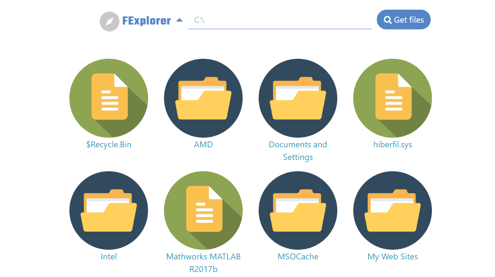

# FExplorer


An attempt at making a generic replica of File Explorer for any Operating System supporting Python.

# Screenshots


# Features
1. Traverse the file system by clicking on folder contents
2. Traverse the file system by writing the file path
3. Go to parent directory

# Requirements

Python module : ```eel```

# Development Mode
## Install
```pip install -r requirements.txt ```

## Run
```python main.py```


# Todos

 - [ ] Packaging the application
 - [x] Beautify the application page
 - [x] Implement Object Oriented Programming in JavaScript
 - [x] Add Images to README.md
 - [ ] Fill README.md
 - [x] Add Feature to go to parent directory
 - [ ] Verify on all Operating Systems
 - [x] Make an icon :P
 - [x] Get icons for different types of files
 - [x] List Files from Input Text
 - [x] List Files on clicking icons
